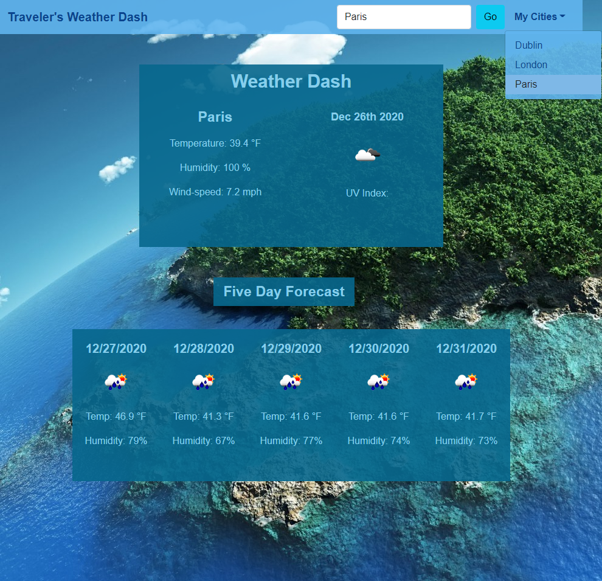

# Traveler's Weather Dash

This is a responsive application designed to use the OpenWeather API to load a weather dashboard displaying current conditions as well as a five-day forecast for any city the user searches for. Weather conditions are called from the API for each city including the temperature, humidity, wind speed , and the UV index, whose severity is indicated by color.  Searched cities are stored in client-side storage and added to the dropdown menu for the user to access at will.

## Table of Contents
* [Getting Started](#getting-started)
* [Built With](#built-with)
* [Main Page](#main-page)
* [Deployment](#deployment)
* [Acknowledgements](#acknowledgements)
* [Next Steps](#next-steps)
* [Author](#author)

## Getting Started
There are no special instructions to get a copy of this project up and running on your local machine. Simply click on the deployed application link or copy and paste the url into your search bar to open in the browser of your choice.

## Built With

* HTML
* CSS
* Javascript
* JQuery
* Bootstrap
* Web APIs/ AJAX

## Main Page

## Deployment 

Deployed Application URL: https://jaymemizelle.github.io/travelers-weather-dash/

## Acknowledgements
API calls for getting all weather info called from: https://openweathermap.org/api

## Next Steps
Refactor code for readability by abstracting the functions built within the AJAX api calls. 

 ## Author
* Jayme Mizelle
